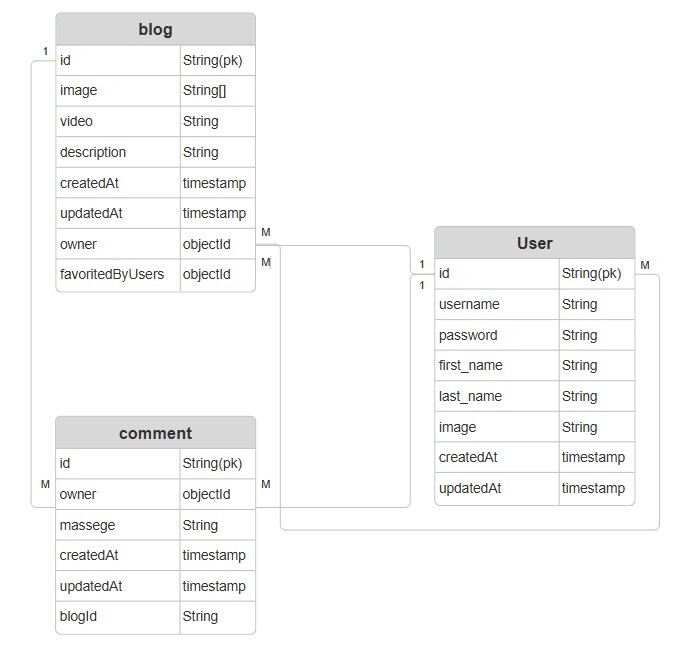

# GA-Blog
## Date: 1/10/2025
### By: Rabab Hasan Isa and Eman Qarooni
#### [Eman Qarooni GitHub] https://github.com/emanqarooni
#### [Rabab Hasan GitHub] https://github.com/Rabab-hasan177

***
### Description
Blog website for our class daily life, where you can post a comment, a picture or a video and others users can interact with your posts.
### ***Technologies***
  * CSS
  * node.js
  * HTML
  * Mongoose
  * express
  * ejs
  * Visual Studio Code
***
### ***Project Link***
#### [GitHub] https://github.com/emanqarooni/GA-Blog

### ***Trello Link***
#### [Trello] https://trello.com/b/LSCo1Mg8/project-2-personal-blog

***
### ***ERD***

### ***WireFrame***
.png)
.png)
.png)
.png)
.png)
.png)
.png)
.png)
.png)
.png)

### ***Website***
.png)
.png)
.png)
.png)
.png)
.png)
.png)
.png)
.png)

### ***Credits***
### [nodemailer] https://medium.com/@kanishksinghmaurya/reset-password-forget-password-implementation-using-node-js-mongodb-nodemailer-jwt-7b2fe9597ca1

### [multer] https://www.npmjs.com/package/multer

### [nodemailer] https://nodemailer.com/

### [sorting] https://mongoosejs.com/docs/api/query.html#Query.prototype.sort()

### [stackoverflow] https://stackoverflow.com/questions/17755147/displaying-an-image-with-ejs-in-node-js-express

### [devAnswers] https://how.dev/answers/what-is-reqquery-in-expressjs

### [w3schools] https://www.w3schools.com/howto/howto_js_search_menu.asp
